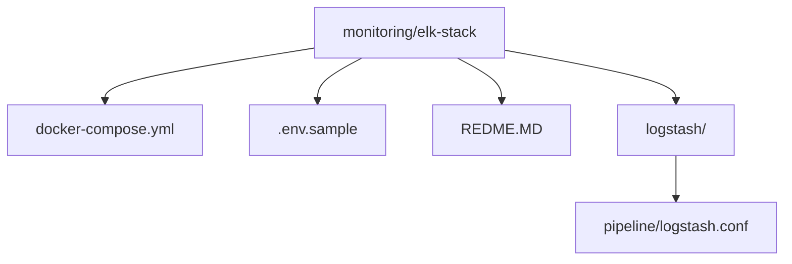
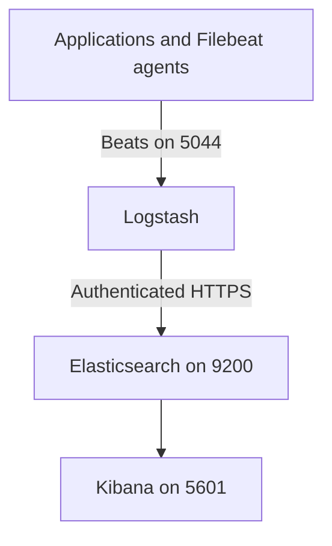
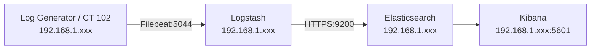

# ELK Stack

The ELK stack is the logging part of the wider [HomeLab project](../../README.MD). It provides a central place to collect logs, store and search them, and explore them through Kibana. The stack is intended for local monitoring, development, and homelab workloads.

ELK stands for:

- **Elasticsearch**: stores, indexes, and searches log events.
- **Logstash**: receives Beats events, processes them, and sends them to Elasticsearch.
- **Kibana**: provides the web interface for searching logs and creating visualizations and dashboards.

## Current Versions

The version is defined once in `.env` and shared by all Elastic containers:

- Elasticsearch: `9.5.4`
- Logstash: `9.5.4`
- Kibana: `9.5.4`

## Project Structure



### `docker-compose.yml`

The Docker Compose file defines the complete ELK deployment and its startup dependencies:

- **`setup`** creates a local certificate authority and an Elasticsearch certificate in the shared `certs` volume. It also verifies that the required passwords exist.
- **`elasticsearch`** runs Elasticsearch as a single node with security and HTTPS enabled. Its data is persisted in the `esdata` Docker volume.
- **`bootstrap`** waits for Elasticsearch to become healthy, sets the Kibana system password, and creates the restricted `logstash_writer` role and user.
- **`kibana`** connects to Elasticsearch over HTTPS using the `kibana_system` account and the generated CA certificate. It publishes the web interface on port `5601`.
- **`logstash`** mounts the pipeline configuration and CA certificate, accepts Beats traffic on port `5044`, and sends events to Elasticsearch over authenticated HTTPS.

The `elk` bridge network allows the containers to communicate by service name. The `certs` volume is shared by the services that need TLS certificates, while `esdata` keeps Elasticsearch data across container restarts.

### `.env.sample`

`.env.sample` is a safe template for the local `.env` file used by Docker Compose. Copy it before starting the stack:

```bash
cp .env.sample .env
```

Replace every placeholder with a locally generated value. The file contains:

- `STACK_VERSION`: the Elastic Stack version used by all services.
- `ELASTIC_PASSWORD`: password for the built-in `elastic` administrator.
- `KIBANA_PASSWORD`: password for Kibana's `kibana_system` account.
- `LOGSTASH_WRITER_PASSWORD`: password for the restricted Logstash writer account.
- `KIBANA_SECURITY_ENCRYPTION_KEY`, `KIBANA_SAVED_OBJECTS_ENCRYPTION_KEY`, and `KIBANA_REPORTING_ENCRYPTION_KEY`: persistent Kibana encryption keys.

Generate passwords with `openssl rand -hex 24` and encryption keys with `openssl rand -hex 32`. Do not commit `.env` or real credentials. Commit only the sanitized `.env.sample` template.

### `logstash/pipeline/logstash.conf`

The current Logstash pipeline listens for Beats traffic on port `5044` and forwards it to Elasticsearch over HTTPS using the `logstash_writer` user. In the homelab, the sender and receiver sit on the `192.168.1.xxx` network, so the Filebeat host talks to the Docker-HCT host over the LAN instead of using a public address.

```conf
input {
  beats {
    port => 5044
  }
}

filter {
}

output {
  if [@metadata][pipeline] {
    elasticsearch {
      id => "elasticsearch_output"
      hosts => ["https://elasticsearch:9200"]

      index => "%{[@metadata][beat]}-%{[@metadata][version]}-%{+YYYY.MM.dd}"

      pipeline => "%{[@metadata][pipeline]}"

      user => "logstash_writer"
      password => "${LOGSTASH_WRITER_PASSWORD}"

      ssl_enabled => true
      ssl_certificate_authorities => ["/usr/share/logstash/certs/ca/ca.crt"]
      ssl_verification_mode => "full"
    }
  } else {
    elasticsearch {
      id => "elasticsearch_output_no_pipeline"
      hosts => ["https://elasticsearch:9200"]

      index => "%{[@metadata][beat]}-%{[@metadata][version]}-%{+YYYY.MM.dd}"

      user => "logstash_writer"
      password => "${LOGSTASH_WRITER_PASSWORD}"

      ssl_enabled => true
      ssl_certificate_authorities => ["/usr/share/logstash/certs/ca/ca.crt"]
      ssl_verification_mode => "full"
    }
  }

  stdout {
    codec => rubydebug
  }
}
```

What this does:

- `input { beats { port => 5044 } }` accepts Filebeat and other Beats inputs from client machines.
- `filter {}` is intentionally empty because the pipeline is currently doing no custom transformation or enrichment before sending data to Elasticsearch.
- `if [@metadata][pipeline]` checks whether the incoming event carries a Logstash ingest pipeline name in Filebeat metadata.
- When a pipeline exists, Logstash sends the event to Elasticsearch with:
  - the index pattern `%{[@metadata][beat]}-%{[@metadata][version]}-%{+YYYY.MM.dd}`
  - the `pipeline => "%{[@metadata][pipeline]}"` setting, so Elasticsearch can apply an ingest pipeline if one was configured upstream.
- The `else` branch handles events that do not include a pipeline value, but still writes them to the same index naming pattern.
- `stdout { codec => rubydebug }` prints the event payload to the Logstash container logs for debugging.
- TLS is enabled for Elasticsearch output with `ssl_enabled => true`, the CA certificate mounted from the `certs` volume, and `ssl_verification_mode => "full"`.

This setup is designed for a lab environment where Filebeat sends structured events into Logstash, and Logstash securely indexes them into Elasticsearch while still being easy to debug in the container logs.

The Compose file also exposes port `5000` for TCP and UDP, but the current Logstash pipeline is not listening on that port yet. The active log ingestion path in this stack is the Beats input on `5044`.

## Architecture



## Quick Start
From this directory:

```bash
cp .env.sample .env
```

Edit `.env`, replacing all `REPLACE_WITH_...` values, then start the stack:

```bash
docker compose up -d
docker compose ps
```

Compose starts the services in order: certificate setup, Elasticsearch health check, security bootstrap, then Kibana and Logstash.

Access Kibana at [http://localhost:5601](http://localhost:5601). Elasticsearch uses HTTPS and requires authentication:

```bash
curl --cacert /path/to/ca.crt \
  -u "elastic:$ELASTIC_PASSWORD" \
  https://localhost:9200
```

The CA certificate is generated inside the `certs` volume. To inspect it from the Elasticsearch container:

```bash
docker compose exec elasticsearch ls /usr/share/elasticsearch/config/certs/ca/ca.crt
```

## Useful Commands

```bash
# View service status
docker compose ps

# Follow all service logs
docker compose logs -f

# Follow one service
docker compose logs -f logstash

# Stop containers while preserving data and certificates
docker compose down

# Stop containers and remove persistent Docker volumes
docker compose down -v
```

Removing volumes deletes Elasticsearch data and generated certificates. The next startup will generate a new CA and initialize the security configuration again.

---

## Troubleshooting
1. Check the service state with `docker compose ps`.
2. Inspect startup failures with `docker compose logs setup elasticsearch bootstrap`.
3. Confirm that the required values in `.env` are not still placeholders.
4. Confirm Elasticsearch health with `docker compose logs elasticsearch` and the authenticated HTTPS request above.
5. Confirm that Filebeat or another Beats client is sending events to port `5044`.
6. Check Logstash output and connection errors with `docker compose logs -f logstash`.
7. If credentials or security settings changed, recreate the stack with `docker compose down -v` and start it again.
---

## Adding Log Agents

See the dedicated guide: [filebeat-homelab-guide.md](filebeat/filebeat-homelab-guide.md).

This guide covers the lab deployment process for a Linux log-generator machine, including Filebeat installation, module configuration, Logstash output, TLS validation, pipeline loading, and Kibana verification.



## Security and Scope

Security is enabled by default. Elasticsearch and Logstash communicate over HTTPS, and Logstash uses a dedicated account limited to writing `filebeat-*` indices. Keep this deployment on a trusted lab network, protect `.env`, and never commit passwords, private keys, certificates, or generated data.

This is a single-node lab deployment, not a production-ready cluster. For production use, add a multi-node Elasticsearch design, external secret management, backups, resource limits, and access controls appropriate to the environment.

## License

This stack is part of the HomeLab project and is intended for local monitoring and lab use.
