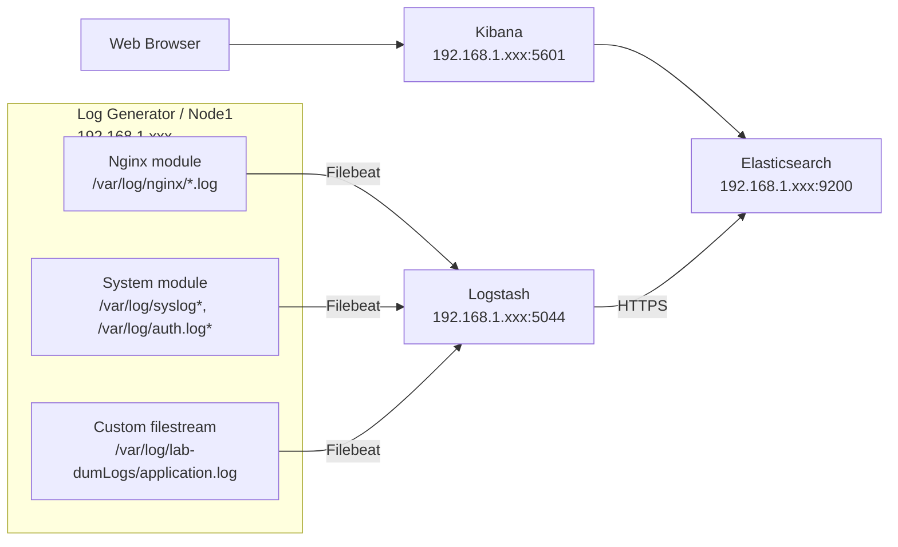
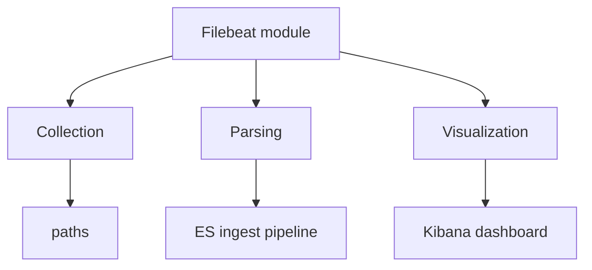
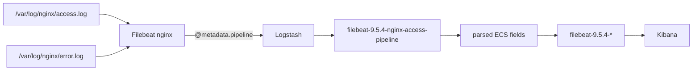
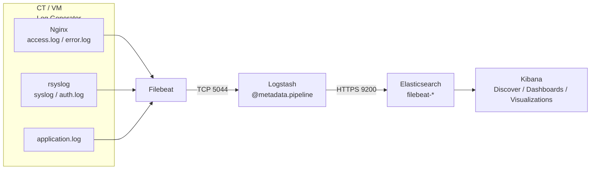

## Filebeat Homelab Deployment Guide

> Filebeat → Logstash → Elasticsearch → Kibana

> **Purpose:** A clean, repeatable Filebeat deployment for Linux log-generator VMs/CTs in a homelab.
>
> The goal is that when a log-generator CT is deleted/recreated, you or a colleague can follow this guide and get:
>
> - Filebeat collecting the intended logs
> - Filebeat modules parsing Nginx/System logs
> - Filebeat sending everything to Logstash
> - Logstash preserving Filebeat's ingest-pipeline metadata
> - Elasticsearch ingest pipelines parsing module events
> - Elasticsearch indexing the events
> - Kibana dashboards working
> - No accidental collection of unrelated `/var/log/*.log` files
> - A predictable validation procedure

---

## 0. Reference architecture



### Important design rule

**Do not use a broad generic input such as:**

```yaml
paths:
  - /var/log/*.log
```

when you are already using Filebeat modules.

That can collect logs that should belong to a module and can create duplicate/incorrectly parsed events. Keep generic inputs explicit and narrow.

---

# 1. Version policy

This guide was validated against the following lab stack:

```text
Filebeat        9.5.4
Elasticsearch   9.5.4
Logstash        9.5.4
Kibana          9.5.4
Debian          12
```

Keep the Elastic components on the same release line.

Before installing anything:

```bash
filebeat version
```

and on the Elastic host:

```bash
docker exec <elasticsearch-container> bin/elasticsearch --version
docker exec <logstash-container> bin/logstash --version
```

---

# 2. Network prerequisites

Example:

```text
Node1 / log generator
192.168.1.xxx

Docker-HCT / Elastic host
192.168.1.xxx
```

Required connectivity:

```text
Node1 -> Docker-HCT:5044    Filebeat -> Logstash
Node1 -> Docker-HCT:9200    Filebeat setup -> Elasticsearch
Node1 -> Docker-HCT:5601    Dashboard setup -> Kibana
```

Check from the Filebeat machine:

```bash
ping -c 3 192.168.1.xxx
```

Check Logstash:

```bash
nc -vz 192.168.1.xxx 5044
```

Check Elasticsearch:

```bash
curl -k https://192.168.1.xxx:9200
```

Expected result:

```text
HTTP 401
missing authentication credentials
```

A `401` here is **good**. It proves the HTTPS endpoint is reachable and Elasticsearch security is enabled.

---

# 3. TLS: understand the certificate hostname

This is one of the most important lessons from this deployment.

This command failed:

```bash
curl --cacert /etc/filebeat/ca.crt \
  -u elastic:'PASSWORD' \
  https://192.168.1.xxx:9200
```

with:

```text
SSL: no alternative certificate subject name matches target host name '192.168.1.xxx'
```

That means the CA is trusted, but the **server certificate does not contain `192.168.1.xxx` in its SANs**.

This is different from a bad CA.

The same environment worked with:

```bash
curl --cacert /etc/filebeat/ca.crt \
  -u elastic:'PASSWORD' \
  https://elasticsearch:9200
```

Therefore the certificate was issued for the hostname:

```text
elasticsearch
```

## Rule

When TLS verification is enabled:

```text
URL hostname
      =
certificate SAN
```

For example:

```text
https://elasticsearch:9200
```

requires the certificate to contain:

```text
DNS:elasticsearch
```

Using:

```text
https://192.168.1.xxx:9200
```

requires:

```text
IP:192.168.1.xxx
```

in the certificate SAN.

### Recommended homelab approach

Use a stable DNS name instead of hard-coding an IP.

Example:

```text
elastic.lab.local
```

Then make sure:

```text
elastic.lab.local -> 192.168.1.xxx
```

and issue the Elasticsearch certificate with:

```text
DNS:elastic.lab.local
```

For the existing lab, if `elasticsearch` already resolves from Node1 and matches the certificate, keep using:

```text
https://elasticsearch:9200
```

Do **not** switch to the IP merely because the IP is easier to remember.

---

# 4. Install Filebeat

On the Linux log-generator machine, install the Filebeat version matching the Elastic stack.

Verify:

```bash
filebeat version
```

Expected:

```text
filebeat version 9.5.4
```

Enable the service:

```bash
sudo systemctl enable filebeat
```

Do not start it yet.

---

# 5. Prepare the TLS CA

Copy the CA certificate used to verify Elasticsearch onto the Filebeat host.

Example:

```text
/etc/filebeat/ca.crt
```

Set safe ownership and permissions:

```bash
sudo chown root:root /etc/filebeat/ca.crt
sudo chmod 0644 /etc/filebeat/ca.crt
```

Test it using the hostname present in the Elasticsearch certificate:

```bash
curl --cacert /etc/filebeat/ca.crt \
  -u elastic:'YOUR_PASSWORD' \
  https://elasticsearch:9200
```

Expected:

```json
{
  "name": "elasticsearch",
  "cluster_name": "docker-cluster",
  "version": {
    "number": "9.5.4"
  }
}
```

If this fails with:

```text
Could not resolve host
```

fix DNS or `/etc/hosts`.

For a small lab, `/etc/hosts` can contain:

```text
192.168.1.xxx elasticsearch
```

A proper internal DNS record is preferable for a larger lab.

---

# 6. Filebeat module configuration

Filebeat modules should live in:

```text
/etc/filebeat/modules.d/
```

Filebeat's module loader should be enabled in `filebeat.yml`:

```yaml
filebeat.config.modules:
  path: ${path.config}/modules.d/*.yml
  reload.enabled: false
```

Elastic recommends the `modules.d` layout for module configuration.

---

# 7. Enable the Nginx module

Run:

```bash
sudo filebeat modules enable nginx
```

Create/configure:

```text
/etc/filebeat/modules.d/nginx.yml
```

Use:

```yaml
- module: nginx
  access:
    enabled: true
    var.paths:
      - /var/log/nginx/access.log*
  error:
    enabled: true
    var.paths:
      - /var/log/nginx/error.log*
```

Verify:

```bash
sudo filebeat modules list
```

You should see:

```text
Enabled:
nginx
```

---

# 8. Enable the System module

Run:

```bash
sudo filebeat modules enable system
```

Configure:

```text
/etc/filebeat/modules.d/system.yml
```

Use:

```yaml
- module: system
  syslog:
    enabled: true
    var.paths:
      - /var/log/syslog*
  auth:
    enabled: true
    var.paths:
      - /var/log/auth.log*
```

Verify:

```bash
sudo filebeat modules list
```

You should see:

```text
Enabled:
system
```

---

# 9. Optional: custom application log

If the CT generates an application log that is not supported by a Filebeat module, use a dedicated `filestream` input.

Example:

```text
/var/log/lab-dumLogs/application.log
```

In:

```text
/etc/filebeat/filebeat.yml
```

use:

```yaml
filebeat.inputs:

  - type: filestream
    id: lab-application
    enabled: true
    paths:
      - /var/log/lab-dumLogs/application.log
```

Keep this input specific.

## Do NOT do this:

```yaml
paths:
  - /var/log/*.log
```

unless you intentionally want every matching log file collected as a generic event.

---

# 10. Complete Filebeat output configuration

The production/runtime Filebeat output should point to Logstash:

```yaml
output.logstash:
  hosts: ["192.168.1.xxx:5044"]
```

Do not leave Elasticsearch output enabled at the same time.

The normal runtime architecture is:


---

# 11. Recommended Filebeat processors

A normal lab configuration can use:

```yaml
processors:
  - add_host_metadata:
      when.not.contains.tags: forwarded

  - add_cloud_metadata: ~

  - add_docker_metadata: ~

  - add_kubernetes_metadata: ~
```

If the host is not running Docker/Kubernetes, these processors are harmless in the normal configuration but are not required for a minimal setup.

Keep the configuration simple unless you actually need the metadata.

---

# 12. Example complete `filebeat.yml`

A clean base configuration:

```yaml
filebeat.inputs:

  - type: filestream
    id: lab-application
    enabled: true
    paths:
      - /var/log/lab-dumLogs/application.log

filebeat.config.modules:
  path: ${path.config}/modules.d/*.yml
  reload.enabled: false

output.logstash:
  hosts: ["192.168.1.xxx:5044"]

processors:
  - add_host_metadata:
      when.not.contains.tags: forwarded

  - add_cloud_metadata: ~

  - add_docker_metadata: ~

  - add_kubernetes_metadata: ~
```

Adjust the custom application input if the CT does not have an application log.

---

# 13. Validate Filebeat before starting it

Run:

```bash
sudo filebeat test config
```

Expected:

```text
Config OK
```

Then test the Logstash connection:

```bash
sudo filebeat test output
```

Expected:

```text
logstash:
  host: 192.168.1.xxx:5044
  connection...
    parse host... OK
    dns lookup... OK
    addresses: ...
    dial up... OK
    talk to server... OK
```

If Logstash is plain TCP, a TLS warning is not automatically an error.

---

# 14. Make sure the actual log files exist

This step is mandatory.

Do not assume that installing Nginx means Nginx is producing logs.

Check:

```bash
sudo ls -lah /var/log/nginx/
```

Then:

```bash
sudo tail -n 5 /var/log/nginx/access.log
```

and:

```bash
sudo tail -n 5 /var/log/nginx/error.log
```

Generate traffic:

```bash
curl http://localhost/
```

Then:

```bash
sudo tail -n 5 /var/log/nginx/access.log
```

You should see a request similar to:

```text
127.0.0.1 - - [22/Sep/2026:07:11:54 +0000] "GET / HTTP/1.1" 200 ...
```

If the file does not exist, fix Nginx logging first.

---

# 15. Generate system logs

For Debian systems using rsyslog:

```bash
sudo systemctl enable --now rsyslog
```

Check:

```bash
sudo ls -lah /var/log/syslog
sudo ls -lah /var/log/auth.log
```

Generate an authentication event, for example by using a normal SSH login.

Then:

```bash
sudo tail -n 5 /var/log/auth.log
```

and:

```bash
sudo tail -n 5 /var/log/syslog
```

---

# 16. The critical Logstash configuration

The Logstash pipeline must preserve Filebeat's ingest-pipeline metadata.

Example:

```ruby
input {
  beats {
    port => 5044
  }
}

filter {
}

output {

  if [@metadata][pipeline] {

    elasticsearch {
      id => "elasticsearch_output"

      hosts => ["https://elasticsearch:9200"]

      index => "%{[@metadata][beat]}-%{[@metadata][version]}-%{+YYYY.MM.dd}"

      pipeline => "%{[@metadata][pipeline]}"

      user => "logstash_writer"
      password => "${LOGSTASH_WRITER_PASSWORD}"

      ssl_enabled => true
      ssl_certificate_authorities => ["/usr/share/logstash/certs/ca/ca.crt"]
      ssl_verification_mode => "full"
    }

  } else {

    elasticsearch {
      id => "elasticsearch_output_no_pipeline"

      hosts => ["https://elasticsearch:9200"]

      index => "%{[@metadata][beat]}-%{[@metadata][version]}-%{+YYYY.MM.dd}"

      user => "logstash_writer"
      password => "${LOGSTASH_WRITER_PASSWORD}"

      ssl_enabled => true
      ssl_certificate_authorities => ["/usr/share/logstash/certs/ca/ca.crt"]
      ssl_verification_mode => "full"
    }
  }

  stdout {
    codec => rubydebug
  }
}
```

## The critical line

```ruby
pipeline => "%{[@metadata][pipeline]}"
```

Do not remove this when using Filebeat modules with Elasticsearch ingest pipelines.

For example:


Without this routing, the module event will not receive the intended Elasticsearch ingest pipeline.

---

# 17. Test Logstash configuration

Inside the Logstash container:

```bash
docker exec -it <logstash-container> logstash -t
```

Expected:

```text
Configuration OK
```

Then restart Logstash if you changed the configuration:

```bash
docker restart <logstash-container>
```

Check:

```bash
docker logs --tail 100 <logstash-container>
```

---

# 18. CRITICAL: Load Filebeat ingest pipelines

This is the step that fixed the major problem in the lab.

When Filebeat sends directly to Elasticsearch, module ingest pipelines can be installed automatically.

When Filebeat sends to Logstash, **you must load the module ingest pipelines manually**.

Elastic documents this workflow explicitly.

## Nginx

From the Filebeat host:

```bash
sudo filebeat setup --pipelines --modules nginx \
  -M "nginx.access.enabled=true" \
  -M "nginx.error.enabled=true" \
  -E output.logstash.enabled=false \
  -E output.elasticsearch.enabled=true \
  -E output.elasticsearch.hosts='["https://elasticsearch:9200"]' \
  -E output.elasticsearch.username="elastic" \
  -E output.elasticsearch.password="YOUR_ELASTIC_PASSWORD" \
  -E output.elasticsearch.ssl.certificate_authorities='["/etc/filebeat/ca.crt"]'
```

Expected:

```text
Loaded Ingest pipelines
```

## System

```bash
sudo filebeat setup --pipelines --modules system \
  -M "system.syslog.enabled=true" \
  -M "system.auth.enabled=true" \
  -E output.logstash.enabled=false \
  -E output.elasticsearch.enabled=true \
  -E output.elasticsearch.hosts='["https://elasticsearch:9200"]' \
  -E output.elasticsearch.username="elastic" \
  -E output.elasticsearch.password="YOUR_ELASTIC_PASSWORD" \
  -E output.elasticsearch.ssl.certificate_authorities='["/etc/filebeat/ca.crt"]'
```

Expected:

```text
Loaded Ingest pipelines
```

### Why the `-M` options matter

Filebeat module filesets are disabled by default.

Therefore:

```bash
filebeat setup --pipelines --modules nginx
```

can fail with:

```text
module nginx is configured but has no enabled filesets
```

Explicitly enabling:

```text
nginx.access
nginx.error
```

solves that.

---

# 19. Verify the ingest pipelines

Use:

```bash
curl --cacert /etc/filebeat/ca.crt \
  -u elastic:'YOUR_PASSWORD' \
  "https://elasticsearch:9200/_ingest/pipeline/filebeat-9.5.4-nginx-*?pretty"
```

And:

```bash
curl --cacert /etc/filebeat/ca.crt \
  -u elastic:'YOUR_PASSWORD' \
  "https://elasticsearch:9200/_ingest/pipeline/filebeat-9.5.4-system-*?pretty"
```

You should see the pipelines created by Filebeat.

If Logstash later reports:

```text
pipeline with id [...] does not exist
```

stop here and fix pipeline installation before debugging anything else.

---

# 20. Load the Filebeat dashboards

The dashboards are a separate setup operation.

They are loaded through the Kibana API.

First verify Kibana is reachable:

```bash
curl -I http://192.168.1.xxx:5601
```

Then run:

```bash
sudo filebeat setup --dashboards \
  -E output.logstash.enabled=false \
  -E output.elasticsearch.enabled=true \
  -E output.elasticsearch.hosts='["https://elasticsearch:9200"]' \
  -E output.elasticsearch.username="elastic" \
  -E output.elasticsearch.password="YOUR_ELASTIC_PASSWORD" \
  -E output.elasticsearch.ssl.certificate_authorities='["/etc/filebeat/ca.crt"]' \
  -E setup.kibana.host="http://192.168.1.xxx:5601" \
  -E setup.kibana.username="elastic" \
  -E setup.kibana.password="YOUR_ELASTIC_PASSWORD"
```

The command-line overrides apply to this invocation only.

They do **not** change:

```yaml
output.logstash:
  hosts: ["192.168.1.xxx:5044"]
```

in the permanent configuration.

### Important

Do not use this CA path on Node1:

```text
/usr/share/elasticsearch/config/certs/ca/ca.crt
```

That is an Elasticsearch-container path.

On Node1 use:

```text
/etc/filebeat/ca.crt
```

---

# 21. Dashboard credentials

For a lab, using `elastic` for setup is simple.

For a more controlled environment, create a dedicated Filebeat setup identity with the required privileges and use a less privileged publishing identity for normal operation.

Elastic recommends separating setup privileges from event-publishing privileges.

At minimum, setup needs permissions for the resources it creates, including ingest pipelines and Kibana dashboards.

Do not store production passwords in Git.

---

# 22. Start Filebeat

Once:

- configuration is valid
- Logstash is reachable
- ingest pipelines exist
- dashboards are loaded

start Filebeat:

```bash
sudo systemctl enable --now filebeat
```

Check:

```bash
sudo systemctl status filebeat
```

Follow logs:

```bash
sudo journalctl -u filebeat -f
```

---

# 23. Generate fresh test data

## Nginx

```bash
curl http://localhost/
curl http://localhost/test-filebeat
curl http://localhost/SIIIIIIIIIIIIIIIIIIIIIIIIIIIIIIIIIIII
```

Then:

```bash
sudo tail -n 5 /var/log/nginx/access.log
```

## System

```bash
logger "FILEBEAT-SYSTEM-TEST"
```

Then:

```bash
sudo tail -n 5 /var/log/syslog
```

## Application

```bash
sudo mkdir -p /var/log/lab-dumLogs

echo "FILEBEAT-APPLICATION-TEST $(date -Is)" \
  | sudo tee -a /var/log/lab-dumLogs/application.log
```

---

# 24. Validate the complete pipeline

Do not immediately assume Kibana is broken if data is missing.

Check each layer.

```text
1. Source log exists
        |
        v
2. Filebeat reads it
        |
        v
3. Logstash receives it
        |
        v
4. Elasticsearch accepts it
        |
        v
5. Kibana displays it
```

---

## Check 1 — source

```bash
sudo tail -n 5 /var/log/nginx/access.log
sudo tail -n 5 /var/log/syslog
sudo tail -n 5 /var/log/auth.log
```

---

## Check 2 — Filebeat

```bash
sudo journalctl -u filebeat --since "5 minutes ago"
```

Also:

```bash
sudo filebeat test output
```

---

## Check 3 — Logstash

```bash
docker logs --tail 200 <logstash-container>
```

The `rubydebug` output should show fields such as:

```text
event.module = nginx
event.dataset = nginx.access
fileset.name = access
```

and:

```text
event.module = system
event.dataset = system.syslog
fileset.name = syslog
```

---

## Check 4 — Elasticsearch

Nginx:

```bash
curl --cacert /etc/filebeat/ca.crt \
  -u elastic:'YOUR_PASSWORD' \
  "https://elasticsearch:9200/filebeat-*/_search?q=event.dataset:nginx.access&size=5&pretty"
```

System:

```bash
curl --cacert /etc/filebeat/ca.crt \
  -u elastic:'YOUR_PASSWORD' \
  "https://elasticsearch:9200/filebeat-*/_search?q=event.dataset:system.syslog&size=5&pretty"
```

Application:

```bash
curl --cacert /etc/filebeat/ca.crt \
  -u elastic:'YOUR_PASSWORD' \
  "https://elasticsearch:9200/filebeat-*/_search?q=event.dataset:lab.application&size=5&pretty"
```

For the generic application input, the dataset may not exist unless you explicitly assign one. In that case search using a unique message:

```bash
curl --cacert /etc/filebeat/ca.crt \
  -u elastic:'YOUR_PASSWORD' \
  "https://elasticsearch:9200/filebeat-*/_search?q=message:FILEBEAT-APPLICATION-TEST&size=5&pretty"
```

---

# 25. Kibana validation

Open Kibana:

```text
http://192.168.1.xxx:5601
```

Go to:

```text
Discover
```

Select:

```text
filebeat-*
```

Set the time range to:

```text
Last 15 minutes
```

For Nginx:

```text
event.dataset : "nginx.access"
```

For system:

```text
event.dataset : "system.syslog"
```

For authentication:

```text
event.dataset : "system.auth"
```

Then:

```text
Dashboard
```

Look for the Filebeat/Nginx/System dashboards supplied by your Filebeat version.

---

# 26. The `event.original already exists` warning

During testing, an event appeared with:

```text
error.message:
field [event.original] already exists
```

while also showing:

```text
event.dataset: nginx.access
```

and:

```text
event.original:
192.168.1.3 - - [...]
```

This should be treated as a **separate cleanup item**.

Do not destroy the working pipeline architecture to fix it.

First establish that:

```text
Nginx
  -> Filebeat
  -> Logstash
  -> ingest pipeline
  -> Elasticsearch
  -> Kibana
```

works.

Then investigate exactly which processor is attempting to create/overwrite `event.original`.

Useful commands:

```bash
docker logs <logstash-container> --tail 200
```

and:

```bash
curl --cacert /etc/filebeat/ca.crt \
  -u elastic:'YOUR_PASSWORD' \
  "https://elasticsearch:9200/_ingest/pipeline/filebeat-9.5.4-nginx-access-pipeline?pretty"
```

Do not randomly add filters to Logstash until you know which component is generating the error.

---

# 27. What NOT to do

## Do not remove the pipeline routing

Do not change:

```ruby
pipeline => "%{[@metadata][pipeline]}"
```

to nothing.

That breaks the Filebeat module parsing architecture.

---

## Do not use a broad `/var/log/*.log` input

Avoid:

```yaml
paths:
  - /var/log/*.log
```

when modules already own specific log paths.

Use:

```yaml
paths:
  - /var/log/lab-dumLogs/application.log
```

instead.

---

## Do not point Node1 at a container-only path

Wrong:

```text
/usr/share/elasticsearch/config/certs/ca/ca.crt
```

Correct on Node1:

```text
/etc/filebeat/ca.crt
```

---

## Do not use the Elasticsearch IP with a certificate that only contains a hostname

Wrong:

```text
https://192.168.1.xxx:9200
```

if the certificate only contains:

```text
DNS:elasticsearch
```

Use:

```text
https://elasticsearch:9200
```

or issue a certificate containing the IP/DNS name you actually use.

---

## Do not permanently enable Elasticsearch output just to run setup

The runtime architecture remains:

```yaml
output.logstash:
  hosts: ["192.168.1.xxx:5044"]
```

Use `-E` overrides for one-time setup commands.

---

# 28. New CT deployment checklist

When CT103 replaces CT102:

```text
[ ] Install matching Filebeat version
[ ] Copy /etc/filebeat/ca.crt
[ ] Configure DNS/hosts for Elasticsearch
[ ] Install nginx/rsyslog if required
[ ] Verify actual log files exist
[ ] Enable nginx module
[ ] Enable system module
[ ] Configure exact module paths
[ ] Add only required custom filestream inputs
[ ] Configure Logstash output
[ ] filebeat test config
[ ] filebeat test output
[ ] Load nginx ingest pipelines
[ ] Load system ingest pipelines
[ ] Verify ingest pipelines exist
[ ] Load dashboards if not already loaded
[ ] Enable/start Filebeat
[ ] Generate test logs
[ ] Check Filebeat
[ ] Check Logstash
[ ] Check Elasticsearch
[ ] Check Kibana
```

---

# 29. One-time Elastic host setup vs per-CT setup

This distinction makes the whole lab much easier.

## One-time / Elastic environment

Usually done once:

```text
Elasticsearch
Logstash
Kibana
Logstash pipeline
Kibana dashboards
```

## Every new log-generator CT

Do:

```text
Install Filebeat
        |
        v
Configure modules
        |
        v
Configure Logstash output
        |
        v
Copy CA
        |
        v
Load module ingest pipelines
        |
        v
Start Filebeat
```

The dashboards themselves do not need to be reinstalled every time if they already exist in Kibana.

---

# 30. Recommended repository structure

A GitHub repository can use:

```text
filebeat-homelab/
│
├── README.md
│
├── configs/
│   ├── filebeat.yml.example
│   ├── nginx.yml.example
│   └── system.yml.example
│
├── scripts/
│   ├── install-filebeat.sh
│   ├── setup-pipelines.sh
│   └── validate-filebeat.sh
│
├── docs/
│   ├── architecture.md
│   ├── troubleshooting.md
│   └── new-ct-checklist.md
│
└── .gitignore
```

Never commit:

```text
elastic passwords
API keys
private keys
CA private keys
.env files containing secrets
```

Commit:

```text
.example
.sample
.template
```

files instead.

---

# 31. Example `.gitignore`

```gitignore
# Secrets
.env
*.secret
*.secrets

# TLS private material
*.key
*.p12
*.pfx

# Local credentials
credentials.yml
secrets.yml

# Filebeat local state
data/
logs/

# OS/editor files
.DS_Store
*.swp
```

The public CA certificate can generally be distributed if appropriate for your lab, but **never distribute the CA private key**.

---

# 32. Optional: use Filebeat's keystore

Instead of putting passwords directly in commands/configuration, Filebeat supports a keystore.

Example:

```bash
sudo filebeat keystore create
```

Add a secret:

```bash
sudo filebeat keystore add ELASTIC_PASSWORD
```

Then reference the value:

```yaml
${ELASTIC_PASSWORD}
```

This is preferable to committing credentials into Git.

For automation, use environment variables or a secrets-management system rather than putting real passwords into shell scripts.

---

# 33. Troubleshooting decision tree

## Filebeat cannot connect to Logstash

Check:

```bash
sudo filebeat test output
```

Then:

```bash
nc -vz 192.168.1.xxx 5044
```

Then:

```bash
docker logs <logstash-container>
```

---

## Logstash receives events but Elasticsearch rejects them

Look for:

```text
pipeline with id [...] does not exist
```

If present:

```text
STOP
  |
  v
Load Filebeat ingest pipelines
  |
  v
Verify _ingest/pipeline
  |
  v
Restart/retry
```

---

## Nginx data reaches Logstash but not Elasticsearch

Check:

```text
[@metadata][pipeline]
```

and verify the referenced pipeline exists.

---

## Elasticsearch contains events but Kibana shows nothing

Check:

```text
Time range
Data view
Index pattern
```

Use:

```text
filebeat-*
```

and widen the time range.

---

## Nginx produces no data

Check:

```bash
sudo ls -lah /var/log/nginx/
sudo tail -n 5 /var/log/nginx/access.log
curl http://localhost/
sudo tail -n 5 /var/log/nginx/access.log
```

---

## System logs do not exist

Check:

```bash
sudo systemctl status rsyslog
sudo systemctl enable --now rsyslog
```

Then:

```bash
logger "FILEBEAT-SYSTEM-TEST"
```

---

## TLS certificate hostname error

Example:

```text
no alternative certificate subject name matches target host name
```

Check what hostname the certificate supports.

Do not blindly use:

```text
192.168.1.xxx
```

Use the hostname in the certificate or regenerate the certificate with the desired DNS/IP SAN.

---

# 34. The complete mental model

The most important thing to remember is that **Filebeat modules are more than log collectors**.

A module contains:



For Nginx:



For the custom application log:


The custom input does not automatically get the Nginx/System module parsing.

---

# 35. Golden deployment procedure

For every new Linux log-generator CT:

```bash
# 1. Verify Filebeat
filebeat version

# 2. Verify Elasticsearch
curl --cacert /etc/filebeat/ca.crt \
  -u elastic:'PASSWORD' \
  https://elasticsearch:9200

# 3. Verify config
sudo filebeat test config

# 4. Verify Logstash
sudo filebeat test output

# 5. Verify source logs
sudo tail -n 5 /var/log/nginx/access.log
sudo tail -n 5 /var/log/syslog
sudo tail -n 5 /var/log/auth.log

# 6. Load module pipelines
sudo filebeat setup --pipelines --modules nginx \
  -M "nginx.access.enabled=true" \
  -M "nginx.error.enabled=true" \
  -E output.logstash.enabled=false \
  -E output.elasticsearch.enabled=true \
  -E output.elasticsearch.hosts='["https://elasticsearch:9200"]' \
  -E output.elasticsearch.username="elastic" \
  -E output.elasticsearch.password="PASSWORD" \
  -E output.elasticsearch.ssl.certificate_authorities='["/etc/filebeat/ca.crt"]'

sudo filebeat setup --pipelines --modules system \
  -M "system.syslog.enabled=true" \
  -M "system.auth.enabled=true" \
  -E output.logstash.enabled=false \
  -E output.elasticsearch.enabled=true \
  -E output.elasticsearch.hosts='["https://elasticsearch:9200"]' \
  -E output.elasticsearch.username="elastic" \
  -E output.elasticsearch.password="PASSWORD" \
  -E output.elasticsearch.ssl.certificate_authorities='["/etc/filebeat/ca.crt"]'

# 7. Start Filebeat
sudo systemctl enable --now filebeat

# 8. Generate test events
curl http://localhost/
logger "FILEBEAT-SYSTEM-TEST"

# 9. Verify
sudo journalctl -u filebeat --since "5 minutes ago"
```

Then validate:

```text
Logstash
   ↓
Elasticsearch
   ↓
Kibana
```

---

# 36. Final validation checklist

A deployment is considered **DONE** only when all of these are true:

```text
NETWORK
[✓] Node1 reaches Logstash :5044
[✓] Node1 reaches Elasticsearch :9200
[✓] Node1 reaches Kibana :5601

TLS
[✓] CA is present
[✓] Elasticsearch hostname matches certificate SAN
[✓] No need for permanent TLS verification bypass

FILEBEAT
[✓] Version matches Elastic stack
[✓] Config test passes
[✓] Output test passes
[✓] Nginx module enabled
[✓] System module enabled
[✓] Custom inputs are explicit

SOURCE LOGS
[✓] Nginx access.log exists
[✓] Nginx error.log exists
[✓] syslog exists
[✓] auth.log exists
[✓] Application log exists if required

LOGSTASH
[✓] Configuration test passes
[✓] Beats input listening on 5044
[✓] Filebeat events visible
[✓] @metadata[pipeline] preserved

ELASTICSEARCH
[✓] Nginx ingest pipelines exist
[✓] System ingest pipelines exist
[✓] Events indexed
[✓] event.dataset populated

KIBANA
[✓] filebeat-* data view works
[✓] Nginx events visible
[✓] System events visible
[✓] Dashboards loaded
[✓] Dashboard data appears

SECURITY
[✓] No real passwords committed to Git
[✓] No private keys committed to Git
[✓] Setup credentials separated from runtime credentials where practical
```

---

# 37. Final architecture



---

## The three rules that prevent the original problem

### Rule 1

**Modules own their log paths.**

```text
nginx module -> /var/log/nginx/*
system module -> /var/log/syslog*, /var/log/auth.log*
custom input -> only the specific application log
```

### Rule 2

**Logstash must pass Filebeat's ingest-pipeline metadata.**

```ruby
pipeline => "%{[@metadata][pipeline]}"
```

### Rule 3

**When Filebeat uses Logstash, manually load the module ingest pipelines.**

```bash
filebeat setup --pipelines ...
```

Those three pieces are what make:


work reliably for Filebeat modules.