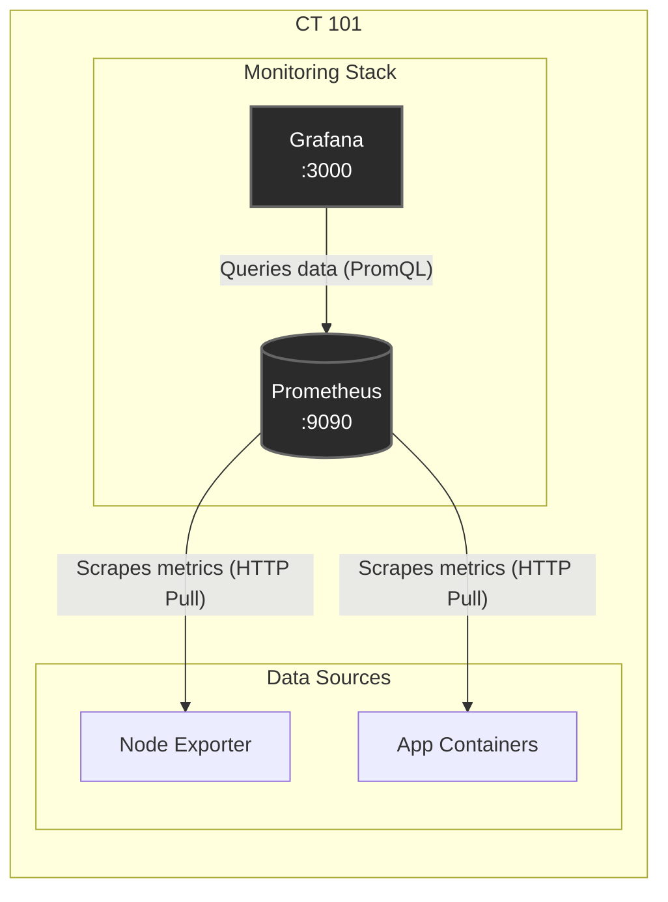
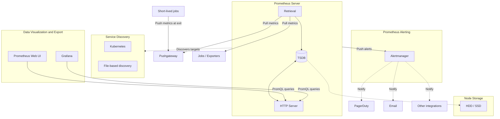

# Home Lab Monitoring: Prometheus & Grafana Stack

This directory contains the Docker Compose configuration and persistent data volumes for the core monitoring stack on host **CT 101**. This stack utilizes **[Prometheus](https://prometheus.io/)** for time-series data collection and **[Grafana](https://grafana.com/)** for rich data visualization.

## Overview
* **Monitoring Stack:** Centralized infrastructure and application monitoring engine for host CT 101 and external nodes.
* **Prometheus:** An open-source systems monitoring and alerting toolkit. It works on a **pull model**, meaning it actively scrapes (pulls) metrics from configured targets (like servers, containers, or applications) over HTTP at regular intervals. It stores this data locally in a highly efficient time-series database (TSDB).
* **Grafana:** A multi-platform open-source analytics and interactive visualization web application. It connects to Prometheus (and other data sources) to query data and display it through customizable dashboards.

## Architecture

Below is the data flow for the monitoring stack:



## Directory Structure

```text
/opt/
└── stacks/
    └── monitoring/
        ├── docker-compose.yml   # The deployment configuration
        ├── .env                 # Environment variables (version tags)
        ├── prometheus/
        │   ├── config/          # Contains prometheus.yml
        │   └── data/            # Persistent Time-Series Database (TSDB)
        │
        └── grafana/
            ├── config/          # Optional: provisioning profiles (dashboards/datasources)
            └── data/            # Persistent Grafana sqlite DB and plugins
```

## Deployment & Setup

Before deploying, ensure the data directories have the correct permissions so the non-root Docker containers can write to them:

```bash
# Set permissions for Prometheus (runs as nobody / uid 65534)
sudo chown -R 65534:65534 /opt/stacks/monitoring/prometheus/data

# Set permissions for Grafana (runs as uid 472)
sudo chown -R 472:472 /opt/stacks/monitoring/grafana/data

# Start the stack
docker compose up -d
```

## Ports & Access

| Service | Port | URL | Default Credentials | Description |
| :--- | :--- | :--- | :--- | :--- |
| **Grafana** | `3000` | `http://<CT-101-IP>:3000` | `admin` / `admin` | Main UI for viewing dashboards and managing data sources. |
| **Prometheus** | `9090` | `http://<CT-101-IP>:9090` | *None* | Raw metrics interface, target status, and PromQL testing. |

## Understanding Metrics

Prometheus stores data as time-series. Every time-series is uniquely identified by its **metric name** and optional key-value pairs called **labels**.

There are three main types of metrics you will encounter:

1. **Counters:** A cumulative metric that only goes up (e.g., `http_requests_total`). Useful for measuring rates.
2. **Gauges:** A metric that can go up and down (e.g., `memory_usage_bytes`, `temperature`).
3. **Histograms:** Samples observations (usually request durations or response sizes) and counts them in configurable buckets.

## PromQL Basics (Prometheus Query Language)

PromQL is the language used in Grafana and Prometheus to query data. Essential examples:

* **Instant Vector (Current state):**
  Returns the latest value of a metric.
  *Example:* `up` (Shows `1` if a target is reachable, `0` if down).

* **Filtering by Labels:**
  Use curly braces to filter specific data.
  *Example:* `up{job="prometheus"}` (Shows status for the Prometheus self-monitoring job).

* **Rates (Crucial for Counters):**
  Calculates per-second average rate of increase over a time window.
  *Example:* `rate(http_requests_total[5m])` (Per-second rate of HTTP requests over the last 5 minutes).

* **Math and Aggregation:**
  Combine metrics or aggregate across instances.
  *Example:* `sum(memory_usage_bytes) by (container_name)` (Total memory usage grouped by container name).

## Prometheus Data Flow

This diagram shows Prometheus service discovery, metric retrieval, storage, alerting, and visualization:



### Data Flow Summary

1. Prometheus discovers targets through Kubernetes or file-based service discovery.
2. The retrieval component scrapes metrics from exporters, jobs, and Pushgateway.
3. Metrics are stored in Prometheus's local time-series database.
4. Grafana and the Prometheus web UI query metrics through the HTTP server.
5. Alerting rules send alerts to Alertmanager, which forwards notifications to configured integrations.