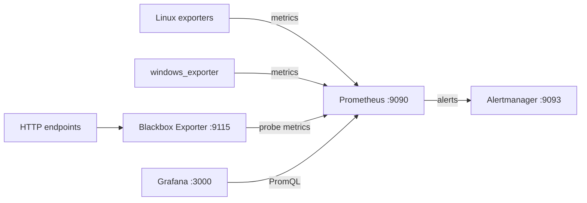

# Home Lab Monitoring

Prometheus, Alertmanager, Grafana, Node Exporter, and Blackbox Exporter run as a Docker Compose stack on **CT 101**. Prometheus collects metrics and evaluates alert rules, Alertmanager delivers email and Slack notifications, and Grafana provides dashboards.

## Architecture


```mermaid
flowchart LR
    Linux[Linux exporters]
    Windows[windows_exporter]
    HTTP[HTTP endpoints]
    Prom[Prometheus :9090]
    Alert[Alertmanager :9093]
    Grafana[Grafana :3000]
    Blackbox[Blackbox Exporter :9115]

    Linux -->|metrics| Prom
    Windows -->|metrics| Prom
    HTTP --> Blackbox
    Blackbox -->|probe metrics| Prom
    Prom -->|alerts| Alert
    Grafana -->|PromQL| Prom
```

The local `node-exporter` container monitors the Linux host running this stack. Remote Linux systems should run Node Exporter on their own operating system. Windows systems should run `windows_exporter` natively as a Windows service.

## Services and ports

| Service | Port | Purpose |
| --- | ---: | --- |
| Prometheus | `9090` | Metrics storage, queries, targets, and alert rules |
| Alertmanager | `9093` | Alert grouping and email/Slack notifications |
| Grafana | `3000` | Dashboards and Prometheus visualization |
| Node Exporter | `9100` | Metrics for the local Linux host |
| Blackbox Exporter | `9115` | HTTP, TCP, and ICMP probes |

The services are exposed on the Docker host. Replace `<CT-101-IP>` with the host address when connecting from another machine.

## Repository layout

```text
/opt/stacks/monitoring/
├── docker-compose.yml
├── .env                         # local secrets and image versions
├── .env.sample                  # safe configuration template
├── alertmanager/
│   ├── alertmanager.yml.tmpl    # uses ${...} variables
│   ├── config/alertmanager.yml  # generated at startup
│   └── data/                    # Alertmanager state
├── grafana/
│   ├── provisioning/            # datasource and dashboard settings
│   └── data/                    # Grafana database and plugins
└── prometheus/
    ├── config/prometheus.yml
    ├── targets/                 # file-based scrape targets
    ├── rules/alert.rules.yml
    ├── blackbox/blackbox.yml
    └── data/                    # Prometheus TSDB
```

## Configuration

Create the local environment file from the template and replace every placeholder:

```bash
cd /opt/stacks/monitoring
cp .env.sample .env
nano .env
```

`.env` supplies image versions, Grafana credentials, SMTP settings, the destination email address, and the Slack webhook. Keep it private and do not commit it.

### Add scrape targets

Edit the file that matches the target type. The files use Prometheus file-based discovery and are mounted read-only into the Prometheus container.

- `prometheus/targets/linux_nodes.yml`: Linux Node Exporter targets on port `9100`.
- `prometheus/targets/windows_nodes.yml`: Windows Exporter targets on port `9182`.
- `prometheus/targets/blackbox_urls.yml`: URLs to probe through Blackbox Exporter.

Each target can include labels such as `os`, `environment`, or `role`. Prometheus watches these files and will pick up changes after its next discovery refresh; use the reload command below when an immediate configuration reload is needed.

### Install Windows Exporter

Install `windows_exporter` natively on each Windows host. The default endpoint is `http://<windows-ip>:9182/metrics`.

```powershell
msiexec /i windows_exporter-0.31.8-amd64.msi ENABLED_COLLECTORS="cpu,cs,logical_disk,net,os,service,system,memory"
New-NetFirewallRule -DisplayName "windows_exporter" -Direction Inbound -Protocol TCP -LocalPort 9182 -Action Allow
```

Then add the host to `prometheus/targets/windows_nodes.yml`.

### Blackbox probes

The configured modules are `http_2xx`, `tcp_connect`, and `icmp_ping`. ICMP requires the `NET_RAW` capability already granted to the Blackbox container. Add URLs to `blackbox_urls.yml` and use the HTTP module unless a different probe module is explicitly configured in `prometheus/config/prometheus.yml`.

## Deploy

The containers run as UID/GID `1000`. Ensure the bind-mounted data directories are writable before the first start:

```bash
sudo chown -R 1000:1000 prometheus/data alertmanager/data grafana/data
docker compose config --quiet
docker compose up -d
docker compose ps
```

The `alertmanager-init` service runs first. It installs `gettext` in a temporary Alpine container, substitutes values from `.env` into `alertmanager.yml.tmpl`, and writes the generated file to `alertmanager/config/alertmanager.yml`. Alertmanager starts only after this step succeeds.

Check the web interfaces:

| URL | Check |
| --- | --- |
| `http://<CT-101-IP>:9090/targets` | Scrape targets are `UP` |
| `http://<CT-101-IP>:9090/rules` | Alert rules loaded successfully |
| `http://<CT-101-IP>:9093` | Alertmanager status and active alerts |
| `http://<CT-101-IP>:3000` | Grafana login and dashboards |
| `http://<CT-101-IP>:9115/probe?target=https://example.com&module=http_2xx` | Manual Blackbox probe |

Grafana provisions the Prometheus datasource automatically. Dashboards placed under `grafana/provisioning/dashboards/json` are discovered by the configured dashboard provider.

## Operations

View logs:

```bash
docker compose logs -f prometheus
docker compose logs -f alertmanager
docker compose logs -f grafana
```

Reload Prometheus after changing `prometheus/config/prometheus.yml`, rules, or target files:

```bash
curl -X POST http://localhost:9090/-/reload
```

Validate the Compose file before applying changes:

```bash
docker compose config --quiet
```

Restart or stop the stack:

```bash
docker compose restart
docker compose down
```

`docker compose down` removes containers and the network but leaves the bind-mounted data directories intact.

## Alert rules and notification flow

The current rules are in `prometheus/rules/alert.rules.yml`:

- `InstanceDown`: a scrape target is unreachable for two minutes.
- `HighCPULoad`: Linux CPU usage exceeds 85 percent for five minutes.
- `BlackboxProbeFailed`: a configured probe fails for one minute.

Critical alerts route to the `critical-alerts` receiver. Normal alerts use the `default` receiver. Both receivers send resolved notifications when enabled by the Alertmanager template.

To test the local exporter alert path:

```bash
docker compose stop node-exporter
```

After the `for: 2m` period, check Prometheus and Alertmanager for `InstanceDown`. Restore the exporter afterward:

```bash
docker compose start node-exporter
```

## Security notes

- Do not expose Prometheus, Alertmanager, or the Blackbox endpoint directly to the internet. Put the web UIs behind the existing reverse proxy with TLS and authentication.
- Use a Gmail app password or provider-specific SMTP credential, never a normal account password.
- Treat `.env` and the generated `alertmanager/config/alertmanager.yml` as secrets. Ensure both are ignored by Git and have restrictive permissions.
- The current rendered Alertmanager config in this checkout contains credential material. Rotate the SMTP credential and Slack webhook immediately, remove the rendered secret-bearing file from version control/history if it was committed, and regenerate it from `.env`.
- Keep image versions pinned in `.env` and upgrade them deliberately.

## References

- [Prometheus documentation](https://prometheus.io/docs/)
- [Alertmanager configuration](https://prometheus.io/docs/alerting/latest/configuration/)
- [Grafana provisioning](https://grafana.com/docs/grafana/latest/administration/provisioning/)
- [Node Exporter](https://github.com/prometheus/node_exporter)
- [Windows Exporter](https://github.com/prometheus-community/windows_exporter)
- [Blackbox Exporter](https://github.com/prometheus/blackbox_exporter)
- [Docker Compose](https://docs.docker.com/compose/)
