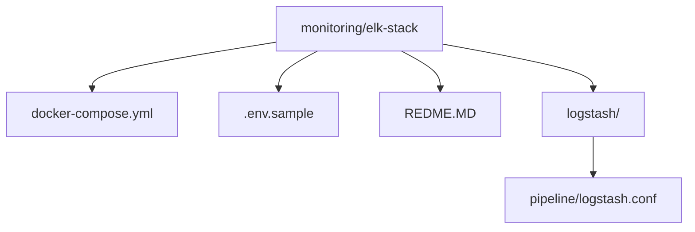
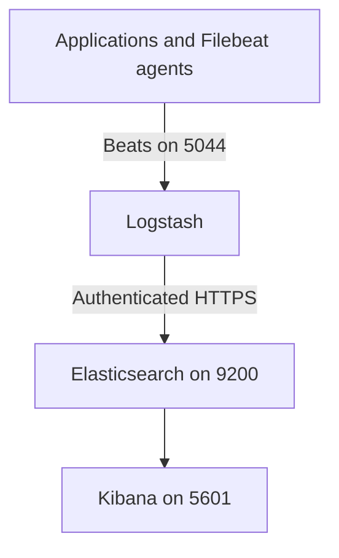
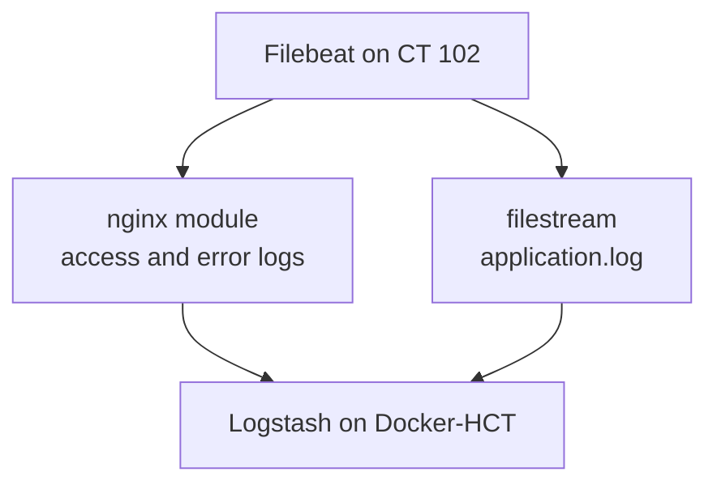

# ELK Stack

The ELK stack is the logging part of the wider [HomeLab project](../../README.MD). It provides a central place to collect logs, store and search them, and explore them through Kibana. The stack is intended for local monitoring, development, and homelab workloads.

ELK stands for:

- **Elasticsearch**: stores, indexes, and searches log events.
- **Logstash**: receives Beats events, processes them, and sends them to Elasticsearch.
- **Kibana**: provides the web interface for searching logs and creating visualizations and dashboards.

## Current Versions

The version is defined once in `.env` and shared by all Elastic containers:

- Elasticsearch: `9.5.4`
- Logstash: `9.5.4`
- Kibana: `9.5.4`

## Project Structure



### `docker-compose.yml`

The Docker Compose file defines the complete ELK deployment and its startup dependencies:

- **`setup`** creates a local certificate authority and an Elasticsearch certificate in the shared `certs` volume. It also verifies that the required passwords exist.
- **`elasticsearch`** runs Elasticsearch as a single node with security and HTTPS enabled. Its data is persisted in the `esdata` Docker volume.
- **`bootstrap`** waits for Elasticsearch to become healthy, sets the Kibana system password, and creates the restricted `logstash_writer` role and user.
- **`kibana`** connects to Elasticsearch over HTTPS using the `kibana_system` account and the generated CA certificate. It publishes the web interface on port `5601`.
- **`logstash`** mounts the pipeline configuration and CA certificate, accepts Beats traffic on port `5044`, and sends events to Elasticsearch over authenticated HTTPS.

The `elk` bridge network allows the containers to communicate by service name. The `certs` volume is shared by the services that need TLS certificates, while `esdata` keeps Elasticsearch data across container restarts.

### `.env.sample`

`.env.sample` is a safe template for the local `.env` file used by Docker Compose. Copy it before starting the stack:

```bash
cp .env.sample .env
```

Replace every placeholder with a locally generated value. The file contains:

- `STACK_VERSION`: the Elastic Stack version used by all services.
- `ELASTIC_PASSWORD`: password for the built-in `elastic` administrator.
- `KIBANA_PASSWORD`: password for Kibana's `kibana_system` account.
- `LOGSTASH_WRITER_PASSWORD`: password for the restricted Logstash writer account.
- `KIBANA_SECURITY_ENCRYPTION_KEY`, `KIBANA_SAVED_OBJECTS_ENCRYPTION_KEY`, and `KIBANA_REPORTING_ENCRYPTION_KEY`: persistent Kibana encryption keys.

Generate passwords with `openssl rand -hex 24` and encryption keys with `openssl rand -hex 32`. Do not commit `.env` or real credentials. Commit only the sanitized `.env.sample` template.

### `logstash/pipeline/logstash.conf`

The Logstash pipeline currently:

1. Accepts Beats/Filebeat events on port `5044`.
2. Sends them to `https://elasticsearch:9200` using the dedicated `logstash_writer` account.
3. Writes daily indices using the `filebeat-%{+YYYY.MM.dd}` pattern.
4. Verifies Elasticsearch with the CA certificate mounted from the `certs` volume.
5. Prints processed events with the `rubydebug` codec, which is useful while testing the lab.

The Compose file publishes port `5000` for TCP and UDP, but the current pipeline does not define inputs on that port. Only port `5044` is active until a TCP or UDP input is added to `logstash.conf`.

## Architecture



## Quick Start
From this directory:

```bash
cp .env.sample .env
```

Edit `.env`, replacing all `REPLACE_WITH_...` values, then start the stack:

```bash
docker compose up -d
docker compose ps
```

Compose starts the services in order: certificate setup, Elasticsearch health check, security bootstrap, then Kibana and Logstash.

Access Kibana at [http://localhost:5601](http://localhost:5601). Elasticsearch uses HTTPS and requires authentication:

```bash
curl --cacert /path/to/ca.crt \
  -u "elastic:$ELASTIC_PASSWORD" \
  https://localhost:9200
```

The CA certificate is generated inside the `certs` volume. To inspect it from the Elasticsearch container:

```bash
docker compose exec elasticsearch ls /usr/share/elasticsearch/config/certs/ca/ca.crt
```

## Useful Commands
## Useful Commands
```bash
# View service status
docker compose ps

# Follow all service logs
docker compose logs -f

# Follow one service
docker compose logs -f logstash

# Stop containers while preserving data and certificates
docker compose down

# Stop containers and remove persistent Docker volumes
docker compose down -v
```

Removing volumes deletes Elasticsearch data and generated certificates. The next startup will generate a new CA and initialize the security configuration again.

---

## Troubleshooting
1. Check the service state with `docker compose ps`.
2. Inspect startup failures with `docker compose logs setup elasticsearch bootstrap`.
3. Confirm that the required values in `.env` are not still placeholders.
4. Confirm Elasticsearch health with `docker compose logs elasticsearch` and the authenticated HTTPS request above.
5. Confirm that Filebeat or another Beats client is sending events to port `5044`.
6. Check Logstash output and connection errors with `docker compose logs -f logstash`.
7. If credentials or security settings changed, recreate the stack with `docker compose down -v` and start it again.
---

## Adding Log Agents

### Filebeat on Debian Linux

The following procedure installs Filebeat on CT 102 and sends nginx and application logs to Logstash. Filebeat should use the same major version as Elasticsearch and Logstash. Matching the minor and patch version is recommended when practical.

#### Option A: Install from the Elastic repository

Check the Elasticsearch version from Docker-HCT before installing Filebeat:

```bash
docker exec elasticsearch curl -s --cacert /usr/share/elasticsearch/config/certs/ca/ca.crt \
        -u "elastic:$ELASTIC_PASSWORD" \
        https://localhost:9200
```

Inspect the `version.number` value in the JSON response. If it contains `9.x.x`, install the corresponding Filebeat 9.x package. Use the same major version as the rest of the stack and avoid installing a newer major version by accident.

Add the official Elastic repository and signing key for that major version, then install Filebeat through Debian's package manager. Follow Elastic's package-installation instructions for the selected version.

#### Option B: Install a specific `.deb` package

To install Filebeat `9.5.4` specifically:

```bash
cd /tmp
curl -fL -O https://artifacts.elastic.co/downloads/beats/filebeat/filebeat-9.5.4-amd64.deb
sudo dpkg -i filebeat-9.5.4-amd64.deb
```

If `dpkg` reports missing dependencies, repair them with:

```bash
sudo apt-get install -f
```

Do not start Filebeat until the configuration in the next steps is complete.

### Configure Filebeat

Edit `/etc/filebeat/filebeat.yml` and validate the configuration:

```bash
sudo nano /etc/filebeat/filebeat.yml
sudo filebeat test config
```

Disable direct Elasticsearch output and send events to Logstash instead:

```yaml
output.logstash:
        hosts: ["192.168.1.95:5044"]
```

Make sure direct Elasticsearch output is disabled or commented:

```yaml
#output.elasticsearch:
#  hosts: ["localhost:9200"]
```

The address above assumes `192.168.1.95` is the Docker-HCT host running Logstash. Replace it with the reachable address of that host when necessary. Filebeat sends events to Logstash over the Beats protocol, and Logstash processes and indexes them in Elasticsearch.

### Enable the nginx Module

On CT 102:

```bash
sudo filebeat modules enable nginx
sudo filebeat modules list
sudo nano /etc/filebeat/modules.d/nginx.yml
```

Configure the module to collect nginx access and error logs:

```yaml
- module: nginx
        access:
                enabled: true
                var.paths:
                        - "/var/log/nginx/access.log*"

        error:
                enabled: true
                var.paths:
                        - "/var/log/nginx/error.log*"
```

The nginx module parses access and error logs into structured fields instead of sending only raw log lines.

### Add Custom Application Logs

The nginx module handles `/var/log/nginx/`. Add a regular Filebeat `filestream` input for `/var/log/lab-dumLogs/application.log` in `/etc/filebeat/filebeat.yml`:

```yaml
filebeat.inputs:

- type: filestream
        id: lab-application
        enabled: true
        paths:
                - /var/log/lab-dumLogs/application.log
```

The collection flow is:



### Check Filebeat Configuration

Run both checks before starting the service:

```bash
sudo filebeat test config
sudo filebeat test output
```

The configuration check should return `Config OK`. The output check should test the Logstash connection at `:5044`, including DNS resolution and the TCP connection. This pipeline does not configure TLS on the Beats input, so a warning such as `TLS... WARN secure connection disabled` is expected for the current lab configuration.

### Start Filebeat

```bash
sudo systemctl enable --now filebeat
sudo systemctl status filebeat
sudo journalctl -u filebeat -f
```

The service should report `Active: active (running)`.

### Generate Traffic

Open another CT terminal and generate nginx requests:

```bash
for i in {1..20}; do
        curl -s http://localhost/ > /dev/null
done

for i in {1..10}; do
        curl -s http://localhost/fake-$i > /dev/null
done
```

The application log generator should also produce events such as `INFO`, `WARNING`, and `ERROR`.

### Watch Logstash

On Docker-HCT:

```bash
docker logs -f logstash
```

You should see events containing fields such as `message`, `host`, and `@timestamp`. This is the first major checkpoint: events have crossed the network boundary from CT 102 to Logstash.

### Check Elasticsearch

Because this deployment enables HTTPS, query Elasticsearch with the CA certificate and `elastic` credentials:

```bash
docker compose exec elasticsearch bash -c \
'curl -s --cacert /usr/share/elasticsearch/config/certs/ca/ca.crt \
        -u "elastic:$ELASTIC_PASSWORD" \
        "https://localhost:9200/_cat/indices?v"'
```

You should eventually see a daily index similar to `filebeat-2026.09.19`. That confirms the pipeline:


### Open Kibana

Open Kibana at [http://localhost:5601](http://localhost:5601), then go to **Stack Management > Data Views** and create:

```text
filebeat-*
```

Select `@timestamp` as the timestamp field. Open **Discover**, choose the `filebeat-*` data view, and verify that nginx requests and application events are visible.

---

### Winlogbeat (Windows)
        TODO

---

## Security and Scope

Security is enabled by default. Elasticsearch and Logstash communicate over HTTPS, and Logstash uses a dedicated account limited to writing `filebeat-*` indices. Keep this deployment on a trusted lab network, protect `.env`, and never commit passwords, private keys, certificates, or generated data.

This is a single-node lab deployment, not a production-ready cluster. For production use, add a multi-node Elasticsearch design, external secret management, backups, resource limits, and access controls appropriate to the environment.

## License

This stack is part of the HomeLab project and is intended for local monitoring and lab use.
